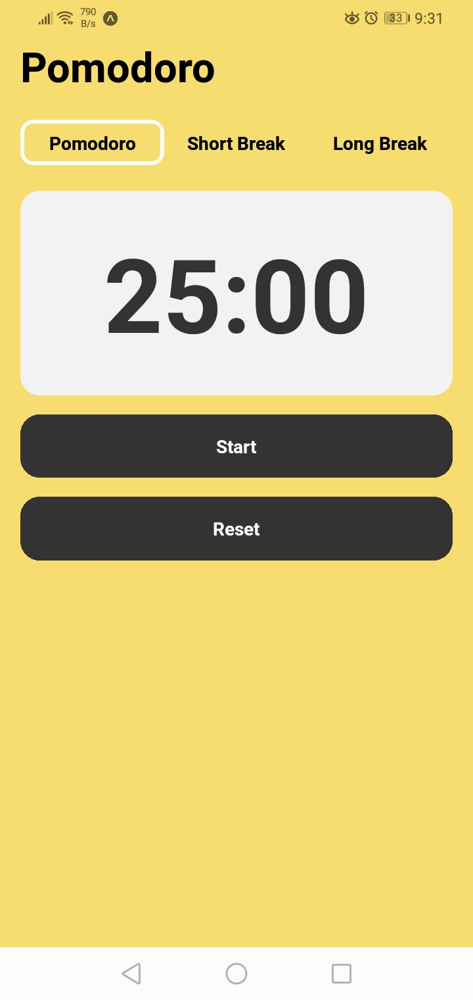
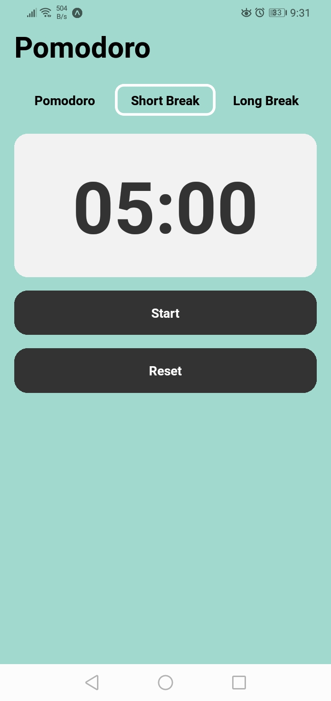
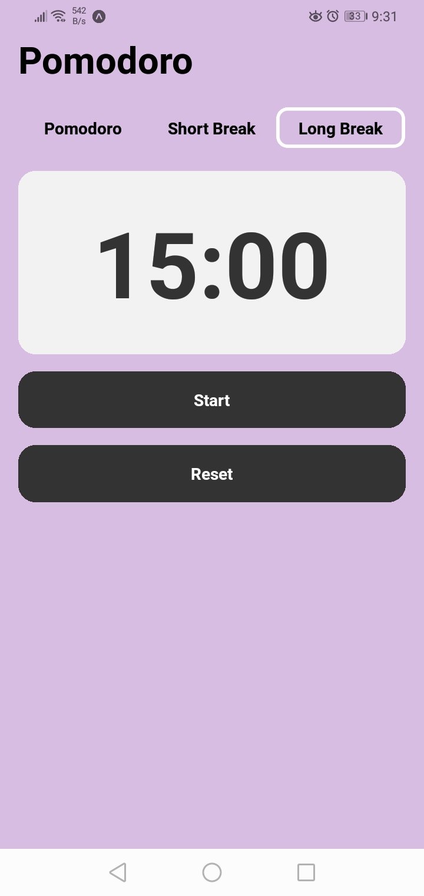

# Pomodoro App React Native

This is a simple yet powerful Pomodoro timer app built using React Native. The Pomodoro Technique is a time management method developed by Francesco Cirillo in the late 1980s, which uses a timer to break work into intervals, traditionally 25 minutes in length, separated by short breaks. This app allows users to customize their work and break intervals, track their productivity, and stay focused on their tasks. With a sleek and intuitive user interface, this app is perfect for students, professionals, or anyone looking to boost their productivity and manage their time effectively. Whether you're tackling assignments, studying for exams, or working on projects, the Pomodoro App React Native is your go-to companion for staying productive and achieving your goals.

## Features:

- Customize work and break intervals
- Track productivity with session statistics
<!-- - Receive notifications for interval changes -->
<!-- - Dark mode support for reduced eye strain -->
- Simple and intuitive user interface
- Cross-platform compatibility with iOS and Android devices
<!-- 

 -->

    
    
    

